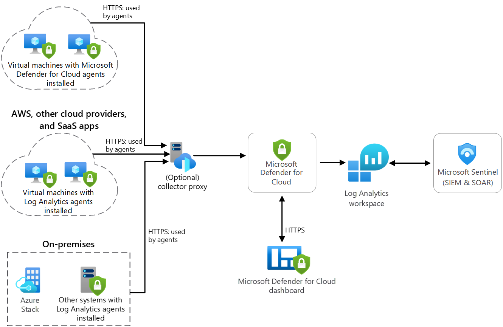

<h2>Azure Security Monitoring and Threat Detection</h2> 

This environment is for multi-national organisation that operates in both on-premises and Azure cloud environment. My solution uses Azure Stack to manipulate their hybrid cloud infrastructure. Security is a top priority, and they require They need monitoring of on-premises, Azure, and Azure Stack workloads the usage of Microsoft Defender for Cloud, Microsoft Sentinel, Azure Monitor, Log Analytics workspace, Log Analytics agent, and a combination of on-premises Windows and Linux structures, in addition to Azure Windows and Linux VMs. 

<b>Infrastructure Overview:</b> 

I designed a hybrid environment including on-premises facts centers, Azure cloud resources, and Azure Stack instances.
Their on-premises community hosts diverse Windows and Linux structures, including servers and workstations.
In Azure, they have got deployed Windows and Linux digital machines (VMs) to run important workloads.
Azure Stack is used to increase their Azure environment to an on-premises records middle. 

<b>Implementing Microsoft Defender for Cloud:</b>

I implemented Microsoft Defender for Cloud (formerly Azure Security Center) to offer unified safety management and superior risk protection across their Azure, Azure Stack, and on-premises assets.
Microsoft Defender for Cloud continuously assesses the security configuration of VMs and provides pointers to improve safety. 

<b>Implementing Microsoft Sentinel:</b>

To centralize protection event tracking and threat detection, they use deployed Microsoft Sentinel (previously Azure Sentinel).
Microsoft Sentinel collects telemetry facts from diverse assets, together with VMs, Azure offerings, and on-premises structures.
It uses advanced analytics and gadget mastering to hit upon and respond to safety threats in real-time. 

<b>Azure Monitor and Log Analytics Workspace:</b>

Azure Monitor is installation to accumulate overall performance and telemetry facts from Azure resources, such as VMs.
I configured a committed Log Analytics workspace to save and analyze log information.
Both Azure resources and on-premises structures send logs to the Log Analytics workspace. 

<b>Log Analytics Agent Deployment:</b>

On-premises Windows and Linux structures have the Log Analytics agent established. This agent collects security and performance facts from those systems and sends it to the Log Analytics workspace.
VMs in Azure additionally have the Log Analytics agent deployed to make certain regular monitoring and telemetry collection. 

<b>Security Configuration and Telemetry Monitoring:</b> 

Microsoft Defender for Cloud continuously assesses the safety configuration of Azure resources, which include VMs, and presents tips to remediate vulnerabilities.
Microsoft Sentinel monitors all incoming protection-related events and telemetry information from Azure, Azure Stack, and on-premises systems.
Security signals are generated in actual-time when suspicious sports or threats are detected.
The security team gets alerts and might check out and respond to incidents using the Microsoft Sentinel dashboard. 

<b>Hybrid Cloud Benefits:</b>

With the solution they leverage Azure Stack to maintain a steady control and security experience throughout their hybrid environment.
They can follow Azure protection solutions to both on-premises and Azure Stack resources, making sure a unified safety posture. 

<b>Continuous Improvement:</b> 

I and the team continously evaluate the suggestions and insights supplied by way of Microsoft Defender for Cloud and Log Analytics to improve security.

